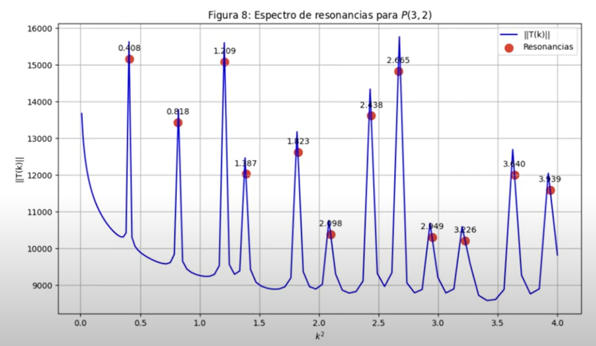

# Quantum Scattering in Parabolic Billiards

## Video presentation
[Watch on YouTube](https://youtu.be/m5GvO2jOCF4)

---

## Introduction
This repository implements the **Boundary Wall Method (BWM)** to solve the **Lippmann–Schwinger (LS) integral equation**, a central tool in scattering theory. The LS equation describes how an incident wave is scattered by a potential.  

In this case, the potentials are defined along **parabolic contours** weighted by a parameter-dependent function. Analytical solutions are known for this geometry, allowing us to validate the numerical BWM approach.

---

## Lippmann–Schwinger Equation and BWM Approximation

The LS equation for this problem is:

$$
\psi(\mathbf{r}) = \phi(\mathbf{r}) + \alpha \int_C H_0^{(1)}(kR)\,\gamma(s)\,\psi(\mathbf{r}'(s))\,ds'
$$

The BWM discretization approximates the integral by a weighted sum over contour points:

$$
\psi(\mathbf{r}) \approx \phi(\mathbf{r}) + \alpha \sum_{j=1}^{N} H_0^{(1)}\!\left(k\lvert \mathbf{r}-\mathbf{r}_j'\rvert\right)\,\Delta s\,(\mathbb{T}\Phi)_j
$$

---

## Main Results

- **Resonant Modes**  
  By scanning the spectrum of the **|T| matrix** as a function of \(k^2\), we identify peaks corresponding to resonant modes.  
    
  Animated results show the scattered wave patterns at resonance:  
  

- **Odd and Even Modes**  
  Resonances behave differently depending on the **incident angle of the wave**. Odd and even modes exhibit distinct scattering profiles.  
  

These results confirm that the BWM reproduces expected spectral features and captures the angular dependence of resonant states.

---

## Repository Structure

- **Makefile** — defines compilation and analysis commands.  
- **include/** — main C++ and CUDA implementations, including billiard generation and the BWM.  
- **ComputationalTimes/** — code for timing, profiling, and plotting performance metrics.  
- **plot_dprob_dfase/** — compute and plot probability density & phase of the scattered wave.  
- **plot_spectrum/** — compute the spectrum and identify resonances.  
- **Videos/** — generate animations of scattered waves across \(k\) or incident angle.  
- **LS.ipynb** — Jupyter notebook with the analytical solution for non-confocal parabolic contours.

---

## Makefile Targets

- `plotb` — Plot the billiard contour.  
- `plot` — Plot probability density and phase of scattered wave.  
- `plotspec` — Compute and plot spectrum with resonances.  
- `run_optimized` — Run optimized C++/CUDA implementations and record timings.  
- `run_not_optimized` — Run non-optimized builds for timing comparison.  
- `omp_times` — Benchmark C++ implementation with varying thread counts.  
- `animation_k` — Generate animations scanning over wave number.  
- `animation_angles` — Generate animations scanning over incident wave angle.  
- `make clean` — Remove temporary data before generating new `.txt` outputs.  

---

## Warning
This repository is configured for an **NVIDIA GeForce 940MX GPU**. If using another GPU, adjust the architecture flag in `nvcc` (`-arch=sm_50`). Always run `make clean` before regenerating data to avoid accumulation in output files.
